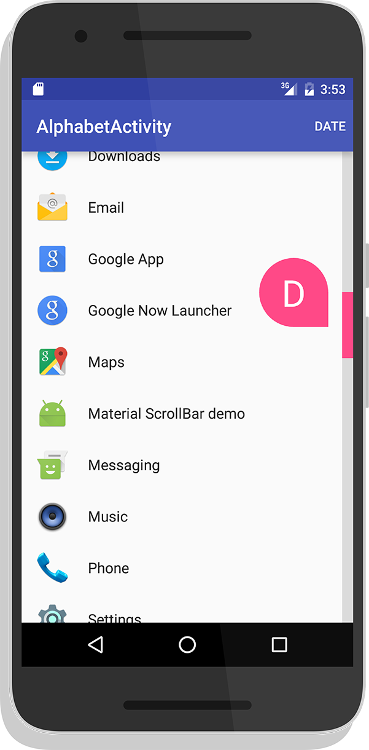

[](http://www.apache.org/licenses/LICENSE-2.0) [](https://jitpack.io/#wynneplaga/materialScrollbar2) [](https://android-arsenal.com/api?level=21) [](https://android-arsenal.com/details/1/2441)

An Android library that brings the Material Design scrollbar to all devices. Designed for Android's `recyclerView`.



[Video](https://youtu.be/F5glJeAFnA4)

[Image Preview](http://imgur.com/a/2SSeY)

[Google Play - Test Out the App](https://play.google.com/store/apps/details?id=com.turingtechnologies.materialscrollbardemo)

[Donate](https://www.paypal.com/cgi-bin/webscr?cmd=_s-xclick&hosted_button_id=UH23JHQ8K4U2C)

## Table of Contents
1. [Gradle](https://github.com/wynneplaga/materialScrollbar2r#gradle)
2. [Documentation](https://github.com/wynneplaga/materialScrollbar2#documentation)
    1. [How to use](https://github.com/wynneplaga/materialScrollbar2#how-to-use)
    2. [My recyclerView elements aren't all the same size! What do I do?](https://github.com/wynneplaga/materialScrollbar2#my-recyclerview-elements-arent-all-the-same-size-what-do-i-do)
    3. [Indicators](https://github.com/wynneplaga/materialScrollbar2#indicators)
    4. [Specific Indicators](https://github.com/wynneplaga/materialScrollbar2#specific-indicators)
3. [License](https://github.com/wynneplaga/materialScrollbar2#license)

## Gradle

```gradle
allprojects {
    repositories {
        maven { url 'https://jitpack.io' }
    }
}
```

```gradle
dependencies {
    implementation 'com.github.wynneplaga:MaterialScrollbar2:1.0.0'
}
```
### How to use

Simply add the following to your XML or instantiate it programtically:

```xml
<com.wynneplaga.materialScrollBar2.MaterialScrollBar
    android:id="@+id/dragScrollBar"
    android:layout_width="wrap_content"
    app:msb_recyclerView="@id/recyclerView"
    app:msb_indicatorType="alphabetic" <!--optional-->
    android:layout_height="match_parent" />
```

Additonal optional attributes:

* msb_handleColor - Color
* msb_textColor - Color
* msb_indicatorType - Color

------

### My recyclerView elements aren't all the same size! What do I do?

If you are in the situation of using headers of one size and elements of another, we've developed a solution speicifcally for you. Please follow the tutorial [here](https://github.com/wynneplaga/materialScrollbar2/wiki/Header-Tutorial).

If you are in some other situation where you're elements are differently sized, implement [ICustomScroller](https://github.com/wynneplaga/materialScrollbar2/blob/master/lib/src/main/java/com/wynneplaga/materialScrollBar2/ICustomScroller.java) in your adapter and complete the included methods.

------

### Indicators

To add an indicator, simply add one of the following to the xml:

```xml
app:msb_indicatorType="alphabetic"
app:msb_indicatorType="date"
app:msb_indicatorType="dateTime"
app:msb_indicatorType="time"
app:msb_indicatorType="custom"
```

You can also add it programitcally:

```kotlin
scrollBar.indicator = AlphabeticIndicator(context, adapter)
```

To use an indicator, you **MUST** make your `recyclerView`'s adapter implement the relevant interface. If you do not, the library will throw a runtime error informing you of your mistake. See documentation for the relevant interface.

------

### Specific Indicators
**AlphabeticIndicator**

**Required Interface:** `INameableAdapter`

To implement an `AlphabetIndicator`, which displays one character usually corresponding to the first letter of each item, add the following to the end of your scroll bar instantiation, or add it as a seperate line.
```xml
app:msb_indicatorType="alphabetic"
```

**DateAndTimeIndicator**

**Required Interface:** `IDateableAdapter`

To implement a `DateTimeIndicator`, which displays any combination of time, day of the month, month, and year, add the following to the end of your scroll bar instantiation, or add it as a seperate line.
```xml
app:msb_indicatorType="date"
app:msb_indicatorType="dateTime"
app:msb_indicatorType="time"
```

All of the arguments are booleans (except for this first one obviously). The indicator will dynamically size, add punctuation, and localise for you. All you need to do is provide a `Date` object for each element in your adapter. You should almost always use miliseconds since the epoch unless you have a good reason not to. Otherwise, the library might crash.

**CustomIndicator**

**Required Interface:** `ICustomAdapter`

To implement a `CustomIndicator`, which displays any text you want, add the following to the end of your scroll bar instantiation, or add it as a seperate line.
```xml
app:msb_indicatorType="custom"
```

## License

Material Scroll Bar:

    Copyright 2016-2021 Wynne Plaga.

    Licensed under the Apache License, Version 2.0 (the "License");
    you may not use this file except in compliance with the License.
    You may obtain a copy of the License at

       http://www.apache.org/licenses/LICENSE-2.0

    Unless required by applicable law or agreed to in writing, software
    distributed under the License is distributed on an "AS IS" BASIS,
    WITHOUT WARRANTIES OR CONDITIONS OF ANY KIND, either express or implied.
    See the License for the specific language governing permissions and
    limitations under the License.

    This licensing is applicable to all code offered as part of this
    repository, which can be identified by the lisence notice preceding
    the content AND/OR by its inclusion in a package starting with "com.
    turingtechnologies.materialscrollbar".

RecyclerView-FastScroll:

     Copyright (C) 2016 Tim Malseed

    Licensed under the Apache License, Version 2.0 (the "License");
    you may not use this file except in compliance with the License.
    You may obtain a copy of the License at

       http://www.apache.org/licenses/LICENSE-2.0

    Unless required by applicable law or agreed to in writing, software
    distributed under the License is distributed on an "AS IS" BASIS,
    WITHOUT WARRANTIES OR CONDITIONS OF ANY KIND, either express or implied.
    See the License for the specific language governing permissions and
    limitations under the License.

Launcher 3:

     Copyright (C) 2010 The Android Open Source Project

    Licensed under the Apache License, Version 2.0 (the "License");
    you may not use this file except in compliance with the License.
    You may obtain a copy of the License at

       http://www.apache.org/licenses/LICENSE-2.0

    Unless required by applicable law or agreed to in writing, software
    distributed under the License is distributed on an "AS IS" BASIS,
    WITHOUT WARRANTIES OR CONDITIONS OF ANY KIND, either express or implied.
    See the License for the specific language governing permissions and
    limitations under the License.
